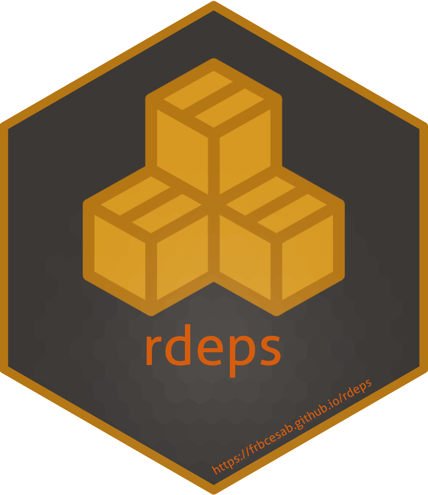

<!-- README.md is generated from README.Rmd. Please edit that file -->

# rdeps 

<!-- badges: start -->

[](https://CRAN.R-project.org/package=rdeps)
[](https://github.com/frbcesab/rdeps/actions/workflows/R-CMD-check.yaml)
[](https://github.com/frbcesab/rdeps/actions/workflows/pkgdown.yaml)
[](https://github.com/frbcesab/rdeps/actions/workflows/test-coverage.yaml)
[](https://codecov.io/gh/frbcesab/rdeps)
[](https://choosealicense.com/licenses/gpl-2.0/)
<!-- badges: end -->

<p align="left">
• <a href="#overview">Overview</a><br> •
<a href="#features">Features</a><br> •
<a href="#installation">Installation</a><br> •
<a href="#get-started">Get started</a><br> •
<a href="#citation">Citation</a><br> •
<a href="#contributing">Contributing</a>
</p>

## Overview

The goal of the R package `rdeps` is to provide a tool to identify all
external packages used in a project (package, compendium, website, etc.)
and to list them in the
[`DESCRIPTION`](https://r-pkgs.org/description.html) file.

## Features

`rdeps` screens all `.R`, `.Rmd`, and `.qmd` files to extract the name
of packages used in a project. This package detects packages called with
`library(foo)`, `require(foo)`, and `foo::bar()` and adds these
dependencies to the `DESCRIPTION` file in the sections *Depends*,
*Imports*, and *Suggests*.

Different types of dependencies are handle:

- if the package is called with `library(foo)` or `require(foo)`, it
  will be added to the section **Depends** of the `DESCRIPTION` file
  (except for vignettes and tests);
- if the package is called with `foo::bar()`, it will be added to the
  section **Imports** of the `DESCRIPTION` file (except for vignettes
  and tests);
- if the package is only used in vignettes or tests, it will be added to
  the section **Suggests** of the `DESCRIPTION` file.

## Installation

You can install the development version from
[GitHub](https://github.com/) with:

``` r
## Install < remotes > package (if not already installed) ----
if (!requireNamespace("remotes", quietly = TRUE)) {
  install.packages("remotes")
}

## Install < rdeps > from GitHub ----
remotes::install_github("frbcesab/rdeps")
```

Then you can attach the package `rdeps`:

``` r
library("rdeps")
```

## Get started

For an overview of the main features of `rdeps`, please read the [Get
started](https://frbcesab.github.io/rdeps/articles/rdeps.html) vignette.

## Citation

Please cite `rdeps` as:

> Casajus Nicolas (2023) rdeps: An R package to identify external
> packages used in a project. R package version 0.0.0.9000,
> <https://github.com/frbcesab/rdeps/>.

## Contributing

All types of contributions are encouraged and valued. For more
information, check out our [Contributor
Guidelines](https://github.com/frbcesab/rdeps/blob/main/CONTRIBUTING.md).

Please note that the `rdeps` project is released with a [Contributor
Code of
Conduct](https://contributor-covenant.org/version/2/1/CODE_OF_CONDUCT.html).
By contributing to this project, you agree to abide by its terms.
